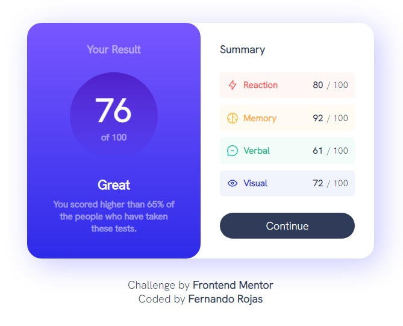
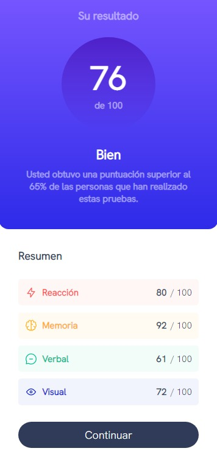

# Frontend Mentor - Results summary component solution

This is a solution to the [Results summary component challenge on Frontend Mentor](https://www.frontendmentor.io/challenges/results-summary-component-CE_K6s0maV). Frontend Mentor challenges help you improve your coding skills by building realistic projects.

## Table of contents

- [Overview](#overview)
  - [The challenge](#the-challenge)
  - [Screenshot](#screenshot)
  - [Links](#links)
- [My process](#my-process)
  - [Built with](#built-with)
  - [What I learned](#what-i-learned)
  - [Continued development](#continued-development)
- [Author](#author)

## Overview

### The challenge

Users should be able to:

- View the optimal layout for the interface depending on their device's screen size
- See hover and focus states for all interactive elements on the page

### Screenshot




### Links

- Solution URL: [Solution Github URL](https://github.com/DF27ARTS/Frontend_Mentor_Challenge_01)
- Live Site URL: [Live site URL](https://df27arts.github.io/Frontend_Mentor_Challenge_01)

## My process

### Built with

- Semantic HTML5 markup
- CSS custom properties
- Flexbox
- CSS Grid
- SASS Preprocessor
- JavaScript

### What I learned

I have worked with json files before but I've never work with them in the frontend, I learn how call them and work with them.

To see how you can add code snippets, see below:

```js
const summaryBoldNumbers = document.querySelectorAll(".summary-bold-number");
const summaryOptionTexts = document.querySelectorAll(".summary-option-text");
const summaryOptionIcons = document.querySelectorAll(".summary-option-icon");

(async () => {
  const response = await fetch("../data.json");
  const data = await response.json();

  summaryBoldNumbers.forEach((item, index) => {
    item.innerText = data[index].score;
    summaryOptionTexts[index].innerText = data[index].category;
    summaryOptionIcons[index].src = data[index].icon;
  });
})();
```

## Author

- Website - [Fernando Rojas](https://portfoliio-three.vercel.app/)
- Frontend Mentor - [@DF27ARTS](https://www.frontendmentor.io/profile/DF27ARTS)
- Twitter - [@\_DF_Fernando](https://twitter.com/_DF_Fernando)
